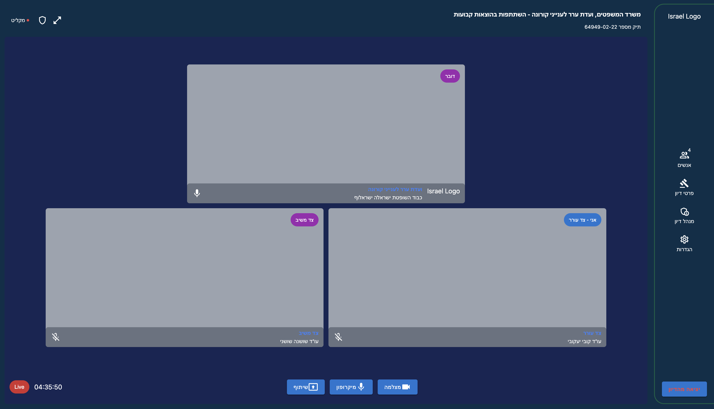
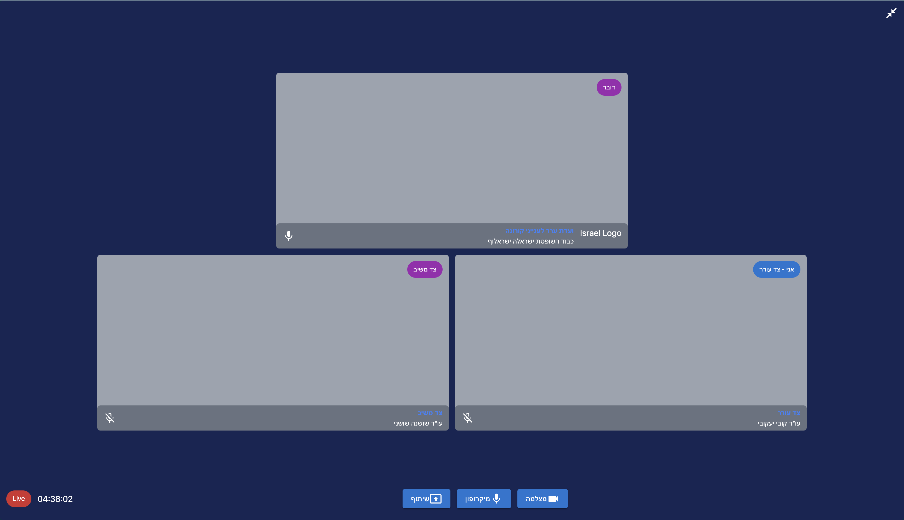
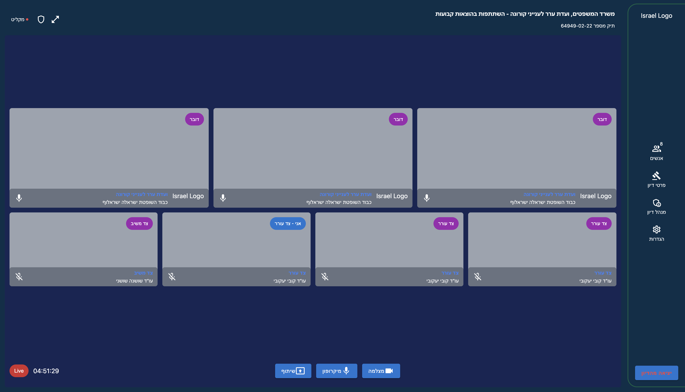
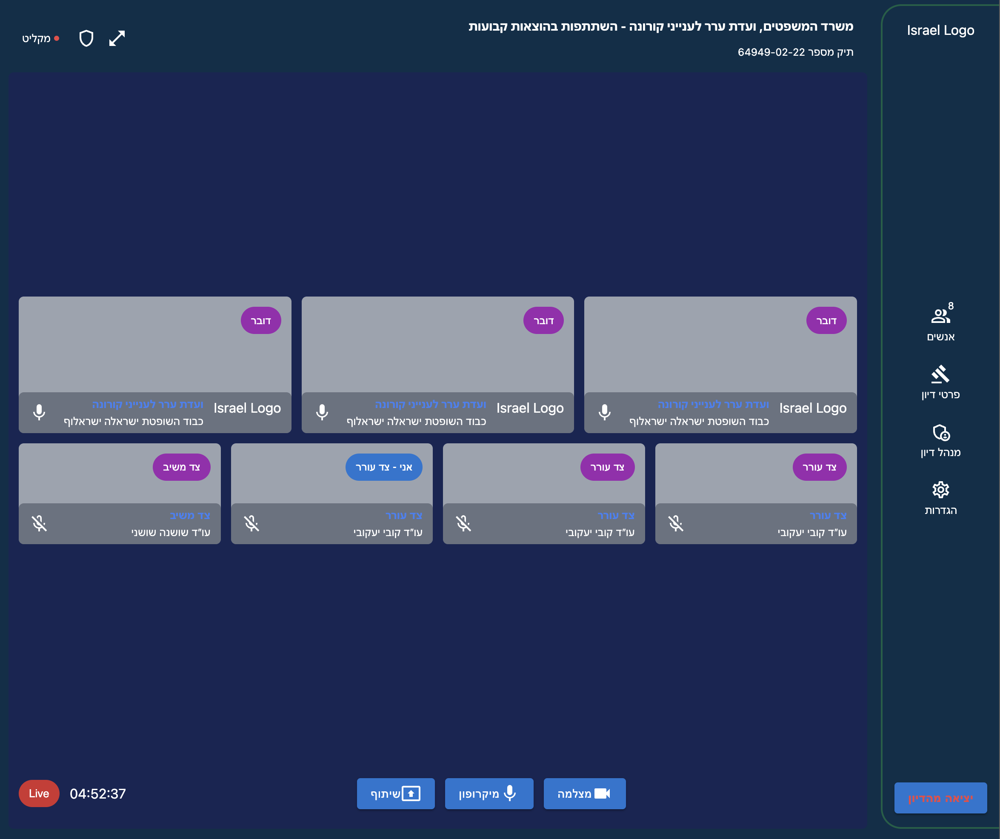
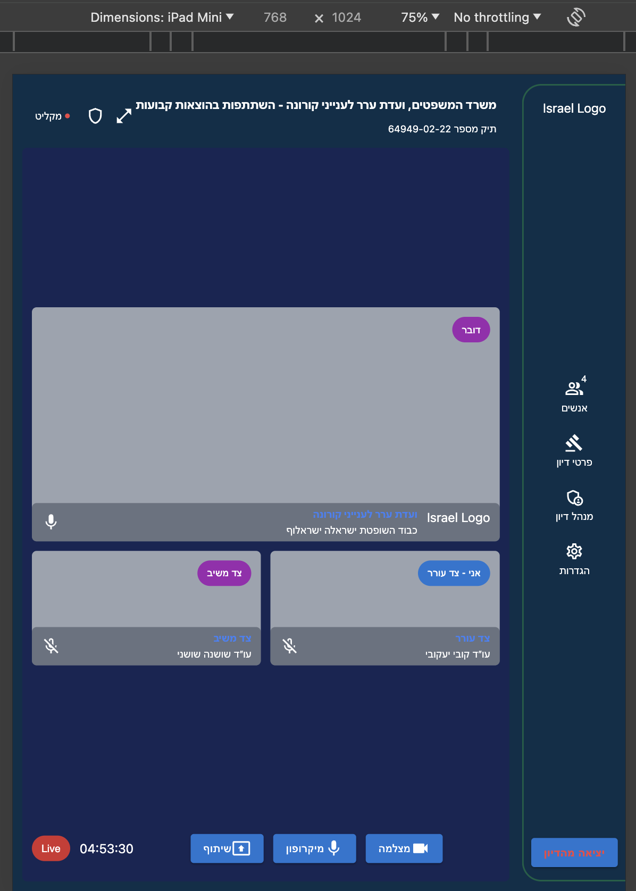
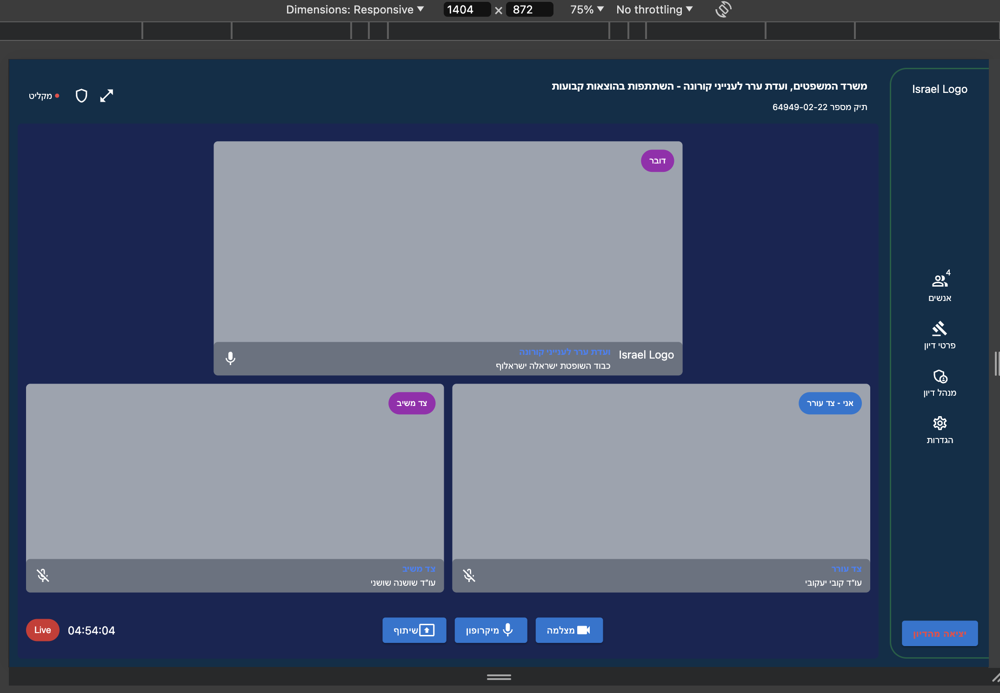

# Video conference Frontend

This is a partial project to implement a UI and bit of UX for a VC application.
The project isn't working in terms of video conference, but has a detailed UI

Visit the site: [http://video-conference-lzaloshinsky.com/](https://lzaloshinsky.github.io/video-conference-fe/)

## Some Snippets

Main Screen

Full Screen

Many Participants

Responsiveness

## Available Scripts

In the project directory, you can run:

### `npm start`

Runs the app in the development mode.\
Open [http://localhost:3000](http://localhost:3000) to view it in the browser.

The page will reload if you make edits.\
You will also see any lint errors in the console.
